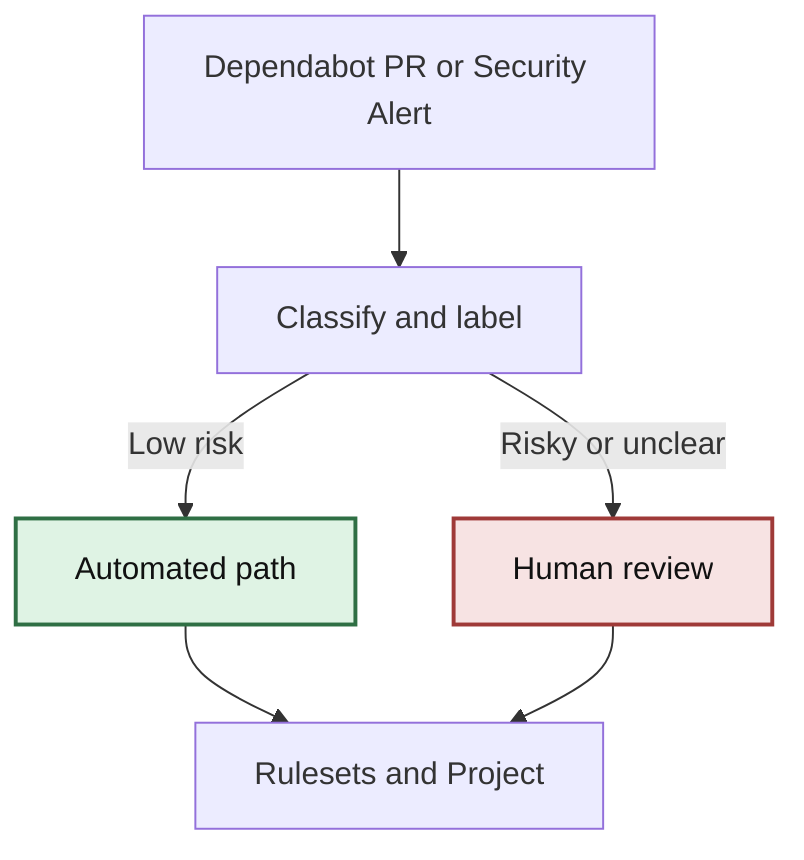

# Dependabot Dependency Operations

## Goal

Routine dependency maintenance becomes low-friction, visible, and safe by default.

This flow is strong because it separates policy from automation: PRs stay the source of truth when they exist, security alerts can be handled directly when they do not, rulesets control merge authority, and risky or ambiguous cases safely route to human review. Teams can keep the baseline path simple and add coordination layers only when they are useful.

## Overview

This repository defines a layered model for dependency maintenance using GitHub-native features. The baseline path can operate from Dependabot PRs, dependency security alerts, or both. The same foundation can add project tracking, repair, and richer routing when that extra coordination helps.

## Architecture

PR or alert = source signal  
Project = operator view  
Rulesets = merge authority  
Workflow runs = telemetry  



## Components

Central workflow:

- classify dependency PRs or security alerts
- sync labels
- update Project
- comment guidance

Worker workflow:

- repair safe failures when a Dependabot PR exists
- escalate risky changes

## Adoption Model

Start with the baseline path: grouping, scheduling, and low-risk automerge when PRs exist, or direct alert triage when teams prefer not to raise PRs. Add Project tracking, repair workflows, and richer routing as optional layers on top of the same system.

## Signal Modes

The campaign workflow supports three signal modes through the `dependency-source` input:

- `auto`: prefer Dependabot PRs when they exist, otherwise operate from dependency security alerts
- `prs`: operate only on Dependabot PRs
- `alerts`: operate only on dependency security alerts, even if no PRs are raised

Use `auto` as the default when you want one workflow that still works if a repository later moves away from opening Dependabot PRs.

## Use From Another Repo

To consume the baseline repair flow from another repository, call the compiled reusable workflow in this repo:

```yaml
name: Dependabot Repair

on:
    pull_request:
        types: [opened, synchronize, reopened]

jobs:
    dependabot-repair:
        if: github.actor == 'dependabot[bot]'
        uses: org/dependabot-latest/.github/workflows/dependabot-repair-reusable.lock.yml@v1
        secrets: inherit
```

The reusable entry point lives in [.github/workflows/dependabot-repair-reusable.md](/Users/mnkiefer/Enterprise/dependabot-latest/.github/workflows/dependabot-repair-reusable.md), and consumers should reference the compiled lockfile so they use a stable GitHub Actions workflow artifact.

Baseline defaults are already baked into the reusable workflow, so `with` is optional unless a caller wants to override behavior. Use workflow inputs for simple operating options, and keep richer policy such as labels, risk keywords, and repo allowlists in config files.

For example, a repo that wants to override only one default can keep the call small:

```yaml
jobs:
    dependabot-repair:
        if: github.actor == 'dependabot[bot]'
        uses: org/dependabot-latest/.github/workflows/dependabot-repair-reusable.lock.yml@v1
        with:
            automerge: false
        secrets: inherit
```

For the advanced coordination layer, a central operations repo can call the campaign workflow with campaign-mode options:

```yaml
name: Dependency Operations Control Plane

on:
    workflow_dispatch:
    schedule:
        - cron: '42 12 * * 1-5'

jobs:
    dependency-operations:
        uses: org/dependabot-latest/.github/workflows/dependabot-campaign.lock.yml@v1
        with:
            dependency-source: auto
            mode: campaign
            config-path: campaign-config.yml
            repo-allowlist-path: repo-allowlist.yml
            project-sync: true
            summary-issue: true
        secrets: inherit
```

Use the repair workflow for local repository behavior when a PR exists, and the campaign workflow for central coordination across repositories whether teams use PRs, security alerts, or both.
