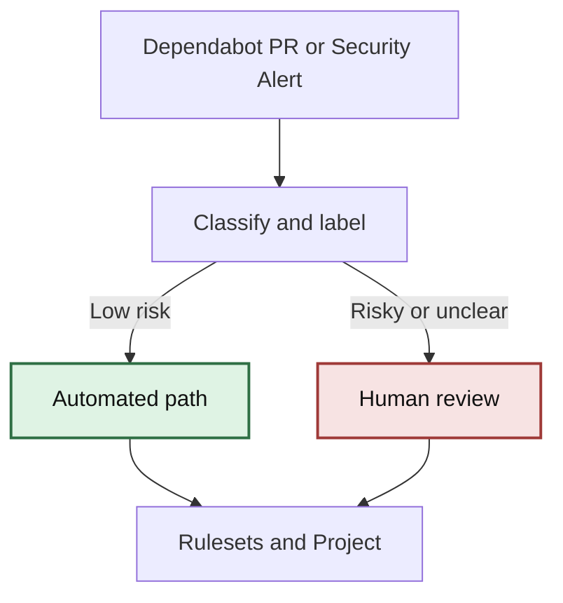

# Dependabot Dependency Operations

## Goal

Routine dependency maintenance becomes low-friction, visible, and safe by default.

This flow is strong because it separates policy from automation: PRs stay the source of truth when they exist, security alerts can be handled directly when they do not, rulesets control merge authority, and risky or ambiguous cases safely route to human review. Teams can keep the baseline path simple and add coordination layers only when they are useful.

## Overview

This repository defines a layered model for dependency maintenance using GitHub-native features. The baseline path can operate from Dependabot PRs, dependency security alerts, or both. The same foundation can add project tracking, repair, and richer routing when that extra coordination helps.

## Architecture

PR or alert = source signal  
Project = operator view  
Rulesets = merge authority  
Workflow runs = telemetry  



## Components

Central workflow:

- classify dependency PRs or security alerts
- sync labels
- update Project
- comment guidance

Worker workflow:

- repair safe failures when a Dependabot PR exists
- escalate risky changes

## Adoption Model

Start with the baseline path: grouping, scheduling, and low-risk automerge when PRs exist, or direct alert triage when teams prefer not to raise PRs. Add Project tracking, repair workflows, and richer routing as optional layers on top of the same system.

## Signal Modes

The campaign workflow supports three signal modes through the `dependency-source` input:

- `auto`: prefer Dependabot PRs when they exist, otherwise operate from dependency security alerts
- `prs`: operate only on Dependabot PRs
- `alerts`: operate only on dependency security alerts, even if no PRs are raised

Use `alerts` as the default when you want security alerts to drive dependency operations without depending on Dependabot PRs. Choose `auto` only when you explicitly want PR-first behavior with an alerts fallback.

## Add To Another Repo

Add the source workflow into the target repository with `gh aw add`, then update the imported copy later with `gh aw update`.

For the baseline local review flow:

```bash
gh aw add githubnext/dependabot-campaign/.github/workflows/dependabot-repair.md --name dependabot-review
```

For the advanced coordination layer:

```bash
gh aw add githubnext/dependabot-campaign/.github/workflows/dependabot-campaign.md
```

If you want the reusable review variant in your own repository, add that file the same way:

```bash
gh aw add githubnext/dependabot-campaign/.github/workflows/dependabot-repair-reusable.md --name dependabot-review-reusable
```

After adding a workflow, review the imported `.md` file and generated `.lock.yml` file in the target repository, then commit them there. The upstream source filenames in this repository still use `dependabot-repair`, but the installed workflow names below use `dependabot-review`.

To pull upstream changes later:

```bash
gh aw update dependabot-review
gh aw update dependabot-campaign
gh aw update dependabot-review-reusable
```

Use the review workflow for local repository behavior when a Dependabot PR exists, and the campaign workflow for central coordination across repositories whether teams use PRs, security alerts, or both. The campaign workflow owns its policy, labels, risk keywords, and enrolled repositories directly in the workflow file.
